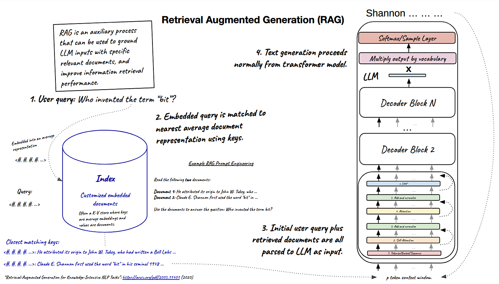

## GWU_DNSC 6290: Course Outline

MSBA elective workshop on AI, from logistic regression to LLMs.

* Session 1: Penalized Regression
* Session 2: Artificial Neural Networks (ANNs) for Structured Data 
* Session 3: ANNs for Computer Vision
* Session 4: Large Language Models

Corrections or suggestions? Please file a [GitHub issue](https://github.com/jphall663/GWU_practical_ai/issues/new).

***

## Preliminary Materials

 * **Syllabus**
 * [Basic Data Manipulation](https://github.com/jphall663/GWU_data_mining/blob/master/01_basic_data_prep/01_basic_data_prep.md)
 * [Primer on Technical Malpractice](https://docs.google.com/presentation/d/1cZeaoIp4cQsVY_gj2a5Pg7ygexepQZRS-ZEn6n2QqEU/edit?usp=sharing)
 * [Whiteboard Notation](https://docs.google.com/presentation/d/1Axf9dizaE3XvGRelBHfsnAlMUPFuMExQ2WNVwQBKMrw/edit?usp=sharing)
 * [Code Instructions](#code-instructions)

## Session 1: Penalized Regression


<sub><sup>Trace plot for a simple elastic net model. **Source:** Assignment 1.</sup></sub>

### Session 1 Materials

* [Lecture Notes](https://docs.google.com/presentation/d/1JVTu_mR_wEoFX66mpy5VxckZLSlaPr8D/edit?usp=sharing&ouid=102464801992802063798&rtpof=true&sd=true)
* [Software Example](https://drive.google.com/file/d/1Se-4yUkheQa3SOGGHfrsT-x5ZS529fl8/view?usp=sharing)
* Assignment 1
  * [Worksheet](https://docs.google.com/document/d/1qwrEl1vztt_NrtCHXQkYrL_C0Ih9PyuU/edit?usp=sharing&ouid=102464801992802063798&rtpof=true&sd=true)
  * [Notebook](https://drive.google.com/file/d/16gq6Bu74DTkIFnaDr3rJp69ebm8Q-1UN/view?usp=sharing)
* References:
  * [_Elements of Statistical Learning_](https://hastie.su.domains/ElemStatLearn/), Sections 3.1 - 3.4, Section 4.4
  * [Regularization and variable selection via the elastic net](https://hastie.su.domains/Papers/B67.2%20(2005)%20301-320%20Zou%20&%20Hastie.pdf)

***

## Session 2: Artificial Neural Networks (ANNs) for Structured Data 


<sub><sup>A very simple autoencoder network. **Source:** Session 2 notes.</sup></sub>

### Session 2 Materials

* [Lecture Notes](https://docs.google.com/presentation/d/1-XweHER3tbVwQFuRxX3mAHol5QYGQpJI/edit?usp=sharing)
* Software Examples:
  * [MLP with simple gradient descent on Sonar data](https://drive.google.com/file/d/1qlw81JovHGBq-ShnxlBAZzEriRSjpEsL/view?usp=sharing)
  * [MLP with simple gradient descent on Iris data](https://github.com/jphall663/GWU_data_mining/blob/master/05_neural_networks/src/py_part_5_basic_mlp_example.ipynb)
  * [MNIST Autoencoder Usage Example](https://github.com/jphall663/GWU_data_mining/blob/master/05_neural_networks/src/py_part_5_MNIST_autoencoder.ipynb)
* Assignment 2
  * [Worksheet](https://docs.google.com/document/d/19EuGMlMprcykcJz0cXd6gX19WBv06aHw/edit?usp=sharing)
  * [Notebook](https://drive.google.com/file/d/1GTALUAAdWl2qmJpSquABEzWUz9WNQWH_/view?usp=sharing)
* References:
  * [_Elements of Statistical Learning_](https://hastie.su.domains/ElemStatLearn/), Sections 11.3 - 11.7
  * Autoencoders:
    * [_Deep Learning_](https://www.deeplearningbook.org/contents/autoencoders.html), Chapter 14
    * [Reducing the Dimensionality of Data with Neural Networks](https://www.cs.toronto.edu/~hinton/absps/science.pdf) 
  * Generalized Additive Models (GAMs):
    * [GAMI-Net: An Explainable Neural Network based on Generalized Additive Models with Structured Interactions](https://arxiv.org/pdf/2003.07132)
    * [Neural Additive Models: Interpretable Machine Learning with Neural Nets](https://arxiv.org/pdf/2004.13912) 

***

## Session 3: ANNs for Computer Vision


<sub><sup>An illustration of image convolution. **Source:** Session 3 notes, with thanks to Wen Phan.</sup></sub>

### Session 3 Materials

* [Lecture Notes](https://docs.google.com/presentation/d/1SSYBn3WrEGh9fM5e4LuQsxr_ALYxdyuv/edit?usp=sharing)
* [Software Example](https://drive.google.com/file/d/17lXz7t8YQcoqT0TRm1TAyyWV-yAvz2R_/view?usp=sharing)
* Assignment 3
  * [Worksheet](https://docs.google.com/document/d/1VU7wprJM_7m28VmVe7R016kyDoPAThlt/edit?usp=sharing)
  * [Notebook](https://drive.google.com/file/d/15UTmI7JhZFQjeilXS84MDiIMKLeRdjPN/view?usp=sharing)
* Reading: [_Deep Learning_](https://www.deeplearningbook.org/), [Chapter 9](https://www.deeplearningbook.org/contents/convnets.html)

***   

## Session 4: Large Language Models



<sub><sup>An illustration of retrieval augmented generation (RAG). **Source:** Session 4 notes.</sup></sub>

### Session 4 Materials

* [Lecture Notes](https://docs.google.com/presentation/d/1nFoo5lRV0B8mT50l0KYYvKPQLuf0F5pA/edit?usp=sharing)
* [Software Example](https://drive.google.com/drive/folders/1RYp-8NrfFertcqOmrq9KHcUQY9lC_Mg4?usp=sharing)
* **Assignment 4**
  * **Worksheet**
  * **Notebook** 
* **Reading**

***

## Code Instructions

* Download the entire class materials folder from the following URL: `https://drive.google.com/drive/folders/17aP3EhWWSho7p1CH7NCrwCIhh7GYOHbR?usp=sharing`.
  * Beside the name of the `AI Workshop` folder click the small triangle.
  * Click Download.

* This should download a zipped folder with a name like `AI Workshop-20250220T171842Z-001.zip`.
  * Extract the zip file into a folder with a name like `AI Workshop-20250220T171842Z-001`.
  * Inside the `AI Workshop-20250220T171842Z-001` folder there should be a subfolder named `AI Workshop`.
  * Upload the subfolder (`AI Workshop-20250220T171842Z-001/AI Workshop`) to your own Google drive.

* The structure of the folder should look like:

```
AI Workshop
├── 01_Regression_Materials
├── 02_ANN_Materials
├── 03_CNN_Materials
└── 04_LLM_Materials
```

* If the Google Colab (Collaboratory) app is not installed, install it by clicking `Open With` and `Connect more apps`. 

* In the top cells of most notebooks, you should notice a command like: `%cd /content/drive/MyDrive/AI_Workshop/01_Regression_Materials/`
  * If that is not the right folder for your Drive, use `%ls` and `%cd` to find the right path.
  * Generally, if this step fails, go to the `Runtime` menu and `Restart Session`. 

* Run code examples by running each cell in order or by going to the `Runtime` menu and choosing `Run All`.
  * All the Colab example notebooks should run without errors after updating the path in the first cell.
  * When prompted, allow Colab to connect to your Google drive.

* To run the last session notebook (`RAG_query.ipynb`), you will need an access token from `HuggingFace.co`.
  * Create a free Hugging Face account (`https://huggingface.co/`).
  * Generate an access token (`Profile` -> `Access Tokens`).
  * Preserve the text of the token somewhere secure, as you may not be able to see it again after it is granted.
  * In the `RAG_query.ipynb` create new secret (by clicking on the key icon on left) named `HF_TOKEN` and populated with the Hugging Face access token.
